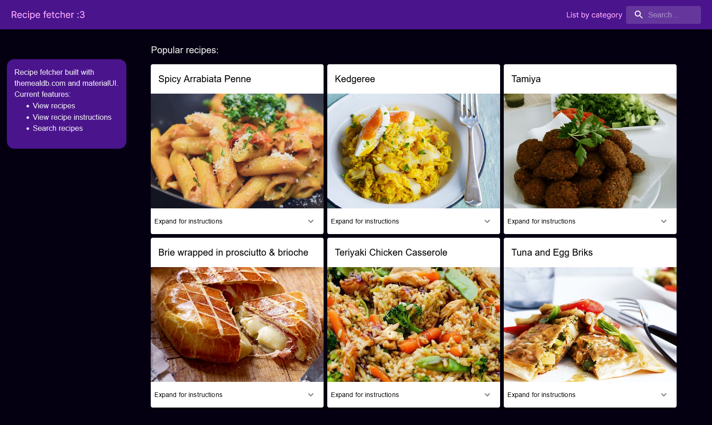

# Recipe Fetcher

Built in React with the MealDB API and Material-UI.

## Current Functions:

- View individual recipes
- Search recipes

## Install Instructions:

1. Clone the repository to your local folder
2. Run `npm install`
3. Run `npm build`
4. Run `npm preview`

When running `npm run dev`, it fetches twice, so run `npm preview` instead :)

